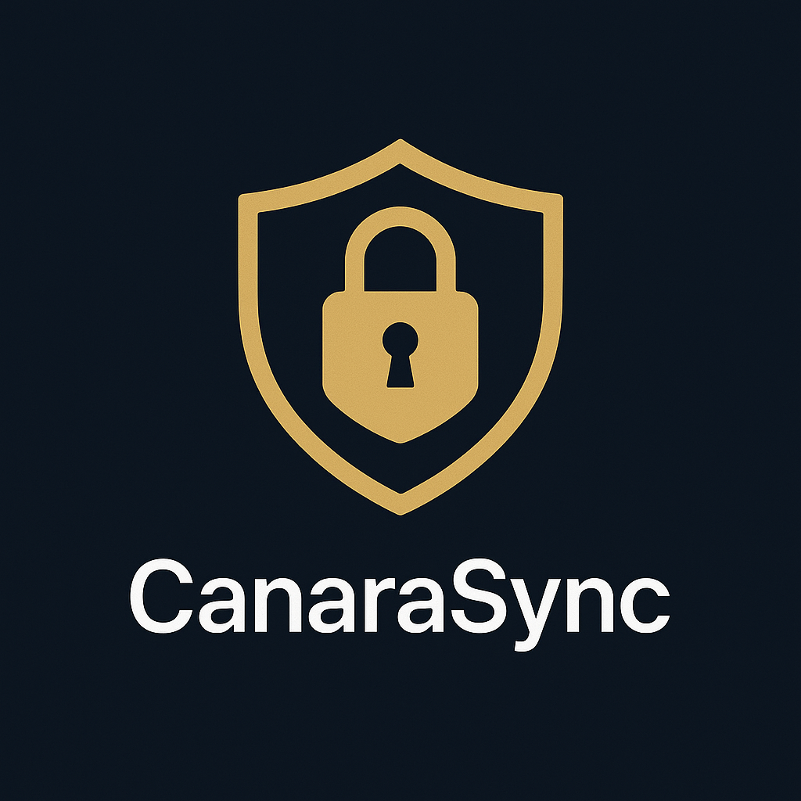

# CanaraSync.AI

**Security that Syncs with Your Every Move**

<p align="center">
  
</p>

Our project presentation on Canva:  
[🔗 View Presentation](https://www.canva.com/design/DAGqP_UtHCs/kbbzkFCc1CI4zbKwpm6FKg/edit)

## Overview

In the age of rapid digitalization, traditional banking security methods are no longer enough. CanaraSync.AI introduces a new paradigm in mobile banking security—one that learns, adapts, and protects based on *you*.

By capturing behavioral signals such as tap dynamics, scroll velocity, typing rhythm, and geolocation context, the app creates a personalized security layer using on-device TinyML. It silently monitors anomalies post-login and alerts the system if suspicious behavior is detected—without compromising user privacy.

Whether you're banking from home, on-the-go, or in shared spaces, CanaraSync.AI ensures your sessions are secure, your identity remains yours, and your peace of mind stays uninterrupted.

## Core Features

- **Behavioral Authentication Engine**  
  Trains on your unique gestures—swipe angle, typing speed, scroll behavior—to create a personalized security signature.

- **Session-Based Learning**  
  Learns your usage style across the first 6 sessions. From the 7th session onwards, it flags deviations as potential threats using an on-device TinyML model.

- **Gesture Intelligence (Scroll, Tap, Swipe)**  
  Every gesture is tracked with precision—capturing velocity, coordinates, pressure fallback, and time—ensuring full behavioral coverage.

- **Geolocation-Aware Security**  
  Seamlessly integrates geolocation data with gesture patterns to enhance context-aware risk scoring.

- **AsyncStorage-Backed Data Collection**  
  All behavioral data is securely and privately stored using `AsyncStorage`, ensuring full control without exposing data to remote servers.

- **Offline-First Architecture**  
  Built to function without internet—ideal for rural users or low-connectivity zones, without compromising security intelligence.

- **Reauthentication Trigger System**  
  In case of anomaly detection, the app initiates a silent reauthentication request—protecting without alerting intruders.

- **Device-Specific Profiling**  
  Adapts to variations in gesture behavior caused by different device models or screen sizes for accurate pattern matching.

- **Privacy-First by Design**  
  No cloud storage, no external APIs—everything stays on your device. Even uninstalling the app clears all behavioral traces automatically.

## Privacy & Compliance

CanaraSync.AI is built with a strong commitment to user privacy, regulatory compliance, and ethical AI design. The app strictly adheres to the following principles and standards:

- **Digital Personal Data Protection (DPDP) Act, India – 2023**  
  All user data is collected with clear purpose, minimal retention, and full user control. Data is stored locally on-device via AsyncStorage and auto-deleted upon uninstallation—ensuring no residual personal data persists.

- **General Data Protection Regulation (GDPR)**  
  While primarily applicable to the EU, CanaraSync.AI embraces GDPR-aligned best practices, including consent-first data capture, right to forget (via uninstall), and complete transparency in data usage.

- **No Cloud, No Compromise**  
  No behavioral data is transmitted to servers. Everything—from gesture data to location logs—remains encrypted and accessible only on the user's device.


##  Tech Stack — Where Innovation Meets Intuition

CanaraSync.AI is a privacy-first, AI-powered mobile app built to redefine security through behavior. Each layer of the stack is handpicked to balance performance, precision, and protection.

###  Frontend
- **React Native (Expo)** – For a seamless cross-platform experience and smooth gesture interactions.
- **TypeScript** – Because clarity and safety belong in every line of code.
- **ShadCN + Tailwind (for future Web/React port)** – Clean UI, rapid prototyping, pixel-perfect design.

###  AI & Behavioral Intelligence
- **TensorFlow Lite (TFLite)** – On-device behavioral anomaly detection powered by TinyML.
- **Custom Autoencoder Model** – Learns user gestures (typing, swipe, scroll) over 6 sessions, flags anomalies after.

###  Local-First Data Management
- **AsyncStorage** – The vault. Secure, persistent, and offline-friendly storage for all user behavioral data.
- **Expo-Device & Expo-Location** – Enrich gesture logs with context like device model and location, all with graceful fallbacks.

###  Privacy-First Architecture
- **No Firebase, No Cloud** – Every byte of personal data stays on-device. No leaks, no links to the web.
- **On-Uninstall Data Wipe** – When the app goes, your data goes with it—automatically.

###  Testing & Debugging
- **Jest + React Native Testing Library** – For confident releases and battle-tested flows.
- **Expo Go & LogBox** – Real-time gesture debugging, performance tuning, and rapid iteration.

---

*Designed for mobile-first security. Developed with care. Delivered with trust.*  

## Installation Guide

1. **Clone the Repository**
   ```bash
   git clone https://github.com/ShantiKumariGautam/CanaraSync.AI.git
   cd CanaraSync.AI
2. Install Dependencies
  ` npm install`

3. Install Expo CLI (if not already installed)
   `npm install -g expo-cli`

4. Start the Development Server
   `npx expo start`

5. Scan the QR code using the Expo Go app on your phone.

## Usage Instructions

1. Launch the app using any of the methods mentioned above.
2. On the **Login** screen, enter your credentials to securely sign in.
3. Use the bottom navigation bar to explore different sections of the app.
4. All user gestures — including tap, scroll, swipe, and typing patterns — are logged automatically in the background.
5. Visit the **Profile** screen to view and manage your personal details.
6. Navigate to the **QR Screen** to generate dynamic QR codes for secure, transactions.
7. Collected data is stored locally on your device and used to train a personalized behavioral AI model.
8. If abnormal behavior is detected, the app will automatically prompt you to reauthenticate for safety.

> ⚠️ Ensure all required permissions (location, touch input, etc.) are enabled for full functionality.


## Project Architecture

The CanaraSync.AI project follows a modular architecture that separates concerns across frontend, behavioral logic, and local storage:

### 1. **Frontend (React Native with Expo)**
- Built using React Native and Expo for cross-platform compatibility.
- UI components are organized screen-wise (Login, Profile, Home, QR Screen, etc.).
- Navigation is managed using React Navigation with a bottom tab structure.

### 2. **Gesture & Behavior Logger**
- Custom hooks and gesture handlers log all user interactions:
  - Tap, Scroll, Swipe
  - Typing speed and backspace usage
  - Session duration and gesture velocity
- Data is enriched with contextual details like screen name, gesture type, and device model.

### 3. **Local Storage (AsyncStorage)**
- All user gesture and session data is stored in a centralized AsyncStorage key: `CanaraSyncData`.
- Data is stored in JSON format and updated in real-time.
- No cloud storage is used to maintain complete on-device privacy.

### 4. **Behavioral Model (TinyML Ready)**
- Behavioral data collected over the first 6 sessions is used to train a personalized anomaly detection model.
- From the 7th session onwards, gestures are compared with the learned profile to detect anomalies.
- Anomaly triggers reauthentication requests.

### 5. **Location Integration**
- Geolocation is fetched using Expo Location API.
- Each session’s gestures are tagged with coordinates and timestamps to strengthen anomaly detection.

### 6. **Security Layers**
- Reauthentication triggered via anomaly detection.
- Silent SOS and duress gesture detection planned for future integration.
- No internet dependency: app works offline to maintain security even in low-connectivity zones.

---

> This architecture ensures real-time, privacy-first behavioral authentication on mobile devices, tailored for women, elderly, and shared-device users.

## Future Scope and Scalability

CanaraSync.AI is built with a forward-looking vision that extends beyond authentication. As we scale, the platform will evolve to become a holistic guardian of mobile security:

### 1. Adaptive AI Personalization
- Integrate continuous learning models that evolve with each user session.
- Enable faster anomaly detection by refining user behavior profiles dynamically.

### 2. Duress Gesture Detection
- Introduce custom gestures to silently trigger SOS alerts under stress.
- Support configurable gestures for user-defined emergency actions.

### 3. Federated Learning Integration
- Implement privacy-preserving AI through on-device federated learning.
- Allow global model updates without compromising local user data.

### 4. Hardware-Level Gesture Sensing
- Utilize advanced sensors like accelerometer, gyroscope, and pressure detection.
- Strengthen authentication accuracy on newer devices.

### 5. Enterprise Integration
- Provide SDKs and APIs for integration into mobile banking and fintech apps.
- Offer CanaraSync.AI as a plug-and-play security module.

### 6. Multi-User Support for Shared Devices
- Enable seamless switching and detection of multiple users on a single device.
- Use behavioral fingerprinting to maintain individual security profiles.

### 7. Visual Dashboard and Risk Insights
- Build an admin-friendly analytics dashboard for institutions.
- Display real-time risk scores, user behavior heatmaps, and anomaly logs.

---

> With privacy as our foundation and personalization as our strength, CanaraSync.AI is poised to redefine mobile security for a safer, smarter tomorrow.

## Unique Selling Proposition (USP)

CanaraSync.AI brings a distinctive blend of innovation, privacy, and intelligent adaptation to mobile security. Unlike traditional one-time authentication models, our solution continuously learns from user behavior — making authentication fluid, seamless, and secure.

### 🔹 Unique Aspects of the Solution
- **Behavioral Biometrics**: Leverages tap dynamics, scroll patterns, and typing rhythm to build a personalized user signature.
- **Offline Support**: Operates seamlessly even in low or no internet environments — ideal for rural and remote users.
- **Session-Based Learning**: Gathers and adapts to user behavior across sessions for better accuracy and anomaly detection.

### 🔹 Innovation and Creativity
- **On-Device AI with TinyML**: Lightweight models run locally without depending on the cloud, ensuring real-time performance and privacy.
- **Duress Gesture Triggers**: Allows predefined subtle gestures to trigger silent SOS alerts — a novel approach to under-pressure security.
- **Fake UI Shielding**: Decoy screens can be shown during suspicious interactions to protect user data under threat.

### 🔹 Security, Performance & Integration Strength
- **Zero Data Exposure**: All data is stored locally with no upload to external servers.
- **Realtime Threat Response**: Flags unusual behavior and prompts reauthentication without interrupting the user experience.
- **Modular Integration**: Can be embedded into existing fintech or banking apps through SDKs or APIs.

---

> CanaraSync.AI isn't just an app — it's a silent guardian, adapting to you, learning from you, and protecting you with every gesture.

## Relevance to the Hackathon Theme

CanaraSync.AI directly aligns with the core objectives of the SuRaksha Cyber Hackathon, which aims to enhance digital safety, resilience, and user trust in critical applications like banking and finance.

### Key Alignments:

- **Behavior-Based Continuous Authentication**  
  Traditional static credentials are no longer sufficient. Our solution ensures that authentication doesn’t stop at login — it continues silently, using user behavior as a key security metric.

- **Privacy-First and On-Device AI**  
  With increasing concerns around data leakage and misuse, CanaraSync.AI ensures all behavioral data is processed and stored locally on the device, aligning with privacy and data sovereignty goals.

- **Offline Functionality for Inclusivity**  
  Our solution is designed to function even in low-connectivity environments, enabling safer digital banking access for users in remote or rural areas — promoting inclusivity and digital empowerment.

- **Real-Time Threat Detection**  
  By identifying behavioral anomalies and triggering reauthentication or silent alerts, the app proactively prevents unauthorized access and potential fraud.

- **Empowering Vulnerable Groups**  
  Special emphasis is placed on usability for women, elderly users, and individuals using shared devices — supporting the broader mission of safe and accessible digital ecosystems.

---

> CanaraSync.AI embodies the spirit of SuRaksha — **security that evolves with users, adapts to threats, and leaves no one behind**.

---

### Developed by Team Cyber Siren  
A project proudly crafted for the SuRaksha Cyber Hackathon 2025.


