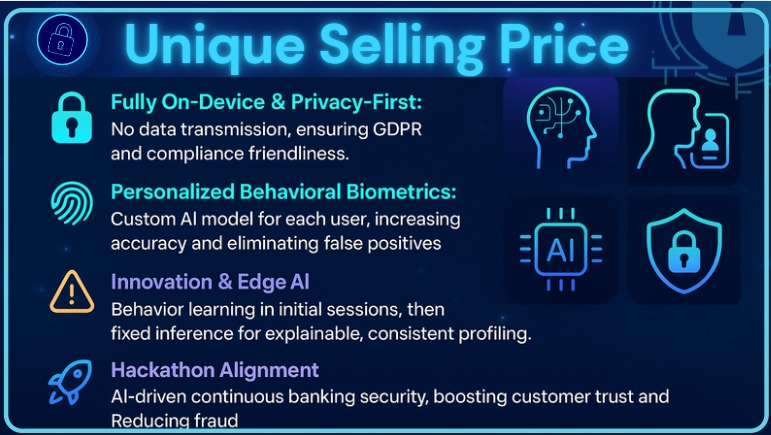

# CanaraSync.AI

**Security that Syncs with Your Every Move**

<p align="center">
  
</p>

Our project presentation on Canva:  
[🔗 View Presentation](https://www.canva.com/design/DAGqP_UtHCs/kbbzkFCc1CI4zbKwpm6FKg/edit)

## Overview

In the age of rapid digitalization, traditional banking security methods are no longer enough. CanaraSync.AI introduces a new paradigm in mobile banking security—one that learns, adapts, and protects based on *you*.

By capturing behavioral signals such as tap dynamics, scroll velocity, typing rhythm, and geolocation context, the app creates a personalized security layer using on-device TinyML. It silently monitors anomalies post-login and alerts the system if suspicious behavior is detected—without compromising user privacy.

Whether you're banking from home, on-the-go, or in shared spaces, CanaraSync.AI ensures your sessions are secure, your identity remains yours, and your peace of mind stays uninterrupted.

## Core Features

- **Behavioral Authentication Engine**  
  Trains on your unique gestures—swipe angle, typing speed, scroll behavior—to create a personalized security signature.

- **Session-Based Learning**  
  Learns your usage style across the first 6 sessions. From the 7th session onwards, it flags deviations as potential threats using an on-device TinyML model.

- **Gesture Intelligence (Scroll, Tap, Swipe)**  
  Every gesture is tracked with precision—capturing velocity, coordinates, pressure fallback, and time—ensuring full behavioral coverage.

- **Geolocation-Aware Security**  
  Seamlessly integrates geolocation data with gesture patterns to enhance context-aware risk scoring.

- **AsyncStorage-Backed Data Collection**  
  All behavioral data is securely and privately stored using `AsyncStorage`, ensuring full control without exposing data to remote servers.

- **Offline-First Architecture**  
  Built to function without internet—ideal for rural users or low-connectivity zones, without compromising security intelligence.

- **Reauthentication Trigger System**  
  In case of anomaly detection, the app initiates a silent reauthentication request—protecting without alerting intruders.

- **Device-Specific Profiling**  
  Adapts to variations in gesture behavior caused by different device models or screen sizes for accurate pattern matching.

- **Privacy-First by Design**  
  No cloud storage, no external APIs—everything stays on your device. Even uninstalling the app clears all behavioral traces automatically.

##  System Architecture

<p align="center">
  
</p>

## Privacy & Compliance

CanaraSync.AI is built with a strong commitment to user privacy, regulatory compliance, and ethical AI design. The app strictly adheres to the following principles and standards:

- **Digital Personal Data Protection (DPDP) Act, India – 2023**  
  All user data is collected with clear purpose, minimal retention, and full user control. Data is stored locally on-device via AsyncStorage and auto-deleted upon uninstallation—ensuring no residual personal data persists.

- **General Data Protection Regulation (GDPR)**  
  While primarily applicable to the EU, CanaraSync.AI embraces GDPR-aligned best practices, including consent-first data capture, right to forget (via uninstall), and complete transparency in data usage.

- **No Cloud, No Compromise**  
  No behavioral data is transmitted to servers. Everything—from gesture data to location logs—remains encrypted and accessible only on the user's device.


##  Tech Stack — Where Innovation Meets Intuition

CanaraSync.AI is a privacy-first, AI-powered mobile app built to redefine security through behavior. Each layer of the stack is handpicked to balance performance, precision, and protection.

###  Frontend
- **React Native (Expo)** – For a seamless cross-platform experience and smooth gesture interactions.
- **TypeScript** – Because clarity and safety belong in every line of code.
- **ShadCN + Tailwind (for future Web/React port)** – Clean UI, rapid prototyping, pixel-perfect design.

###  AI & Behavioral Intelligence
- **TensorFlow Lite (TFLite)** – On-device behavioral anomaly detection powered by TinyML.
- **Custom Autoencoder Model** – Learns user gestures (typing, swipe, scroll) over 6 sessions, flags anomalies after.

###  Local-First Data Management
- **AsyncStorage** – The vault. Secure, persistent, and offline-friendly storage for all user behavioral data.
- **Expo-Device & Expo-Location** – Enrich gesture logs with context like device model and location, all with graceful fallbacks.

###  Privacy-First Architecture
- **No Firebase, No Cloud** – Every byte of personal data stays on-device. No leaks, no links to the web.
- **On-Uninstall Data Wipe** – When the app goes, your data goes with it—automatically.

###  Testing & Debugging
- **Jest + React Native Testing Library** – For confident releases and battle-tested flows.
- **Expo Go & LogBox** – Real-time gesture debugging, performance tuning, and rapid iteration.

---

*Designed for mobile-first security. Developed with care. Delivered with trust.*  


##  Data Pipeline

<p align="center">
  
</p>

## Installation Guide

1. **Clone the Repository**
   ```bash
   git clone https://github.com/ShantiKumariGautam/CanaraSync.AI.git
   cd CanaraSync.AI
2. Install Dependencies
  ` npm install`

3. Install Expo CLI (if not already installed)
   `npm install -g expo-cli`

4. Start the Development Server
   `npx expo start`

5. Scan the QR code using the Expo Go app on your phone.

## Usage Instructions

1. Launch the app using any of the methods mentioned above.
2. On the **Login** screen, enter your credentials to securely sign in.
3. Use the bottom navigation bar to explore different sections of the app.
4. All user gestures — including tap, scroll, swipe, and typing patterns — are logged automatically in the background.
5. Visit the **Profile** screen to view and manage your personal details.
6. Navigate to the **QR Screen** to generate dynamic QR codes for secure, transactions.
7. Collected data is stored locally on your device and used to train a personalized behavioral AI model.
8. If abnormal behavior is detected, the app will automatically prompt you to reauthenticate for safety.

> ⚠️ Ensure all required permissions (location, touch input, etc.) are enabled for full functionality.


CanaraSync.AI is built with a forward-looking vision that extends beyond authentication. As we scale, the platform will evolve to become a holistic guardian of mobile security:


> With privacy as our foundation and personalization as our strength, CanaraSync.AI is poised to redefine mobile security for a safer, smarter tomorrow.

## Unique Selling Proposition (USP)
<p align="center">
  
</p>

> CanaraSync.AI embodies the spirit of SuRaksha — **security that evolves with users, adapts to threats, and leaves no one behind**.

---

### Developed by Team Cyber Siren  
A project proudly crafted for the SuRaksha Cyber Hackathon 2025.


